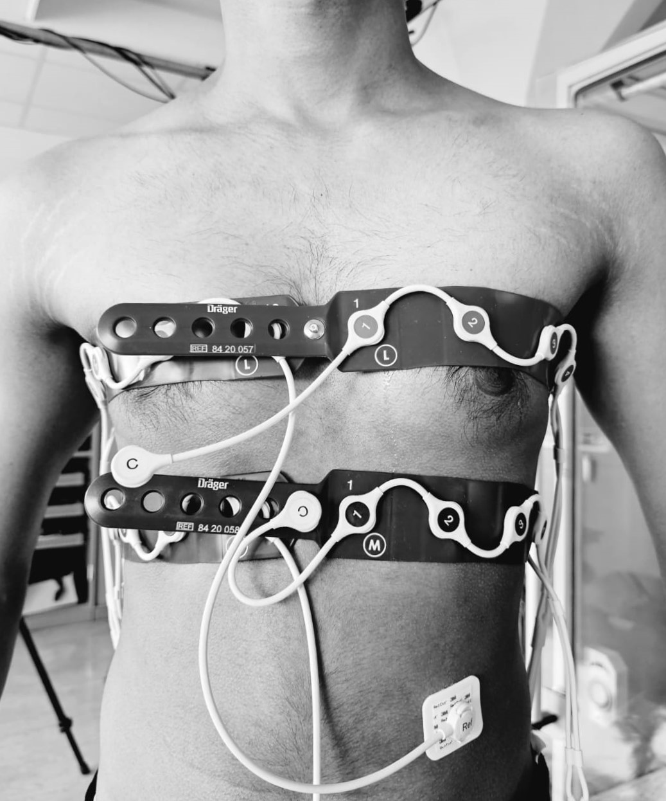

# Influence of Chest and Abdominal Breathing in EIT Imaging

Research Practical Project - Biomedical Engineering (SS23)  
Authors: Martin Mathew George, Sreerag Chandrasekharan, Sumith Thayambath, Bernhard Laufer, Sabine Krüger-Ziolek, Knut Möller

---

## Summary

This project investigates the **influence of chest and abdominal breathing** on air distribution in the lungs using **Electrical Impedance Tomography (EIT)** imaging. The study also examines the effect of **body posture** (standing vs sitting) on lung ventilation. 

Key finding: **Chest breathing leads to more even air distribution compared to abdominal breathing**, and air distribution improves when sitting vs standing.

---

## Methods

### Experimental Setup

- **EIT system**: Pulmovista 500® (Dräger Medical)
- **Motion capture system**: VICON Bonita B10 with 9 infrared cameras
- **Spirometer**: SpiroScout + LFX Software

### Study Subject

- 1 healthy male subject (age 24)  
- Measurements performed with informed consent.

### Measurement Protocol

- Four trials conducted:
  - Postures: **Standing** and **Sitting**
  - EIT Belt positions: **3rd ICS** and **5th ICS**
  - 
  - Breathing patterns: Normal, Abdominal, Chest
    
- Data synchronized from EIT, MoCap, and Spirometer.

### Data Acquisition & Analysis

- EIT images: 16 electrodes, 32x32 frame reconstruction.
- Motion data analyzed using MATLAB and VICON Nexus.
- Spirometer used as reference for tidal volume validation.

---

## Results

### Comparison of Breathing Styles

- EIT shows **clear differences** in air distribution:
  - **Chest breathing** → more even air distribution
  - **Abdominal breathing** → localized air distribution

### Effect of Posture

- Sitting posture → **greater air presence in lungs** than standing.
- Posture significantly affects air distribution patterns.

## Conclusion

- EIT imaging can effectively visualize the influence of breathing style and posture on lung ventilation.
- **Changing breathing patterns** can help utilize healthy lung areas more effectively.
- Future work: expand trials, improve electrode skin contact in dynamic postures, include more breathing cycles for accuracy.

## Tags

`Electrical-Impedance-Tomography` `EIT` `Biomedical-Engineering` `Breathing-Patterns` `Lung-Imaging` `Respiratory-Analysis` `Motion-Capture` `Spirometry` `Scientific-Project` `Master-Program`

